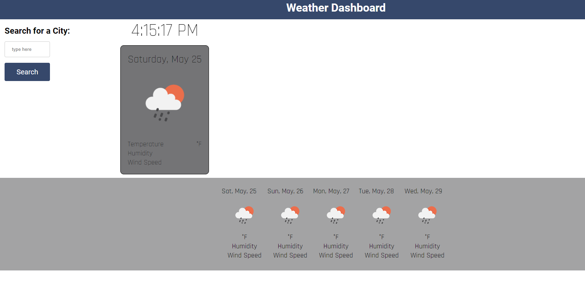
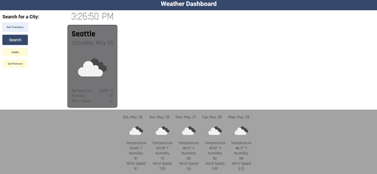

# weather-dashboard

## Description
After utilizing web-based resources and instructional support, I learned how to use a server-side API to provide current and future weather conditions. I dynamically created HTML elements using JavaScript. I used Day.js to display upcoming dates on the 5-day forecast. Moreover, the Weather Dashboard provides important information for travelers who may need weather conditions for multiple cities. 

## Table of Contents 

- [Installation](#installation)
- [Usage](#usage)
- [How-To-Guide](#how-to-guide)
- [Credits](#credits)
- [License](#license)

## Installation

To clone the application, click the green button labeled, "code." Copy the URL for the repository, using HTTPS, SSH, or GitHub CLI. Open Git Bash. Change the working directory to the desired location for the cloned directory. Type "git clone" and paste the copied URL. Press "enter" to create your local clone.

## Usage

Upon page load, the user will see the "Weather Dashboard" title in the header, a search form to collect user input on the left, and the local time above a placeholder "weather card." After completing the form and upon clicking the "Search" button, the user will see the date, temperature, wind speed, and humidity populate for today in the weather card. In the footer, the user will see a 5-day forecast with the date, temperature, wind speed, and humidity for the user-provided city. The search history is saved in local storage and buttons are dynamically created for each saved city name. The user can click the search history buttons to see previously viewed weather conditions. 

# [link to completed project](https://hweltzien.github.io/weather-dashboard/)

## How-To-Guide
<ul>    
    <li>GIVEN a weather dashboard with form inputs</li>
    <li>WHEN I search for a city</li>
    <li>THEN I am presented with current and future conditions for that city and that city is added to the search history</li>
    <li>WHEN I view current weather conditions for that city</li>
    <li>THEN I am presented with the city name, the date, an icon representation of weather conditions, the temperature, the humidity, and the wind speed</li>
    <li>WHEN I view future weather conditions for that city</li>
    <li>THEN I am presented with a 5-day forecast that displays the date, an icon representation of weather conditions, the temperature, the wind speed, and the humidity</li>
    <li>WHEN I click on a city in the search history</li>
    <li>THEN I am again presented with current and future conditions for that city</li>
</ul>

## Credits
<ul>
    <li>Tutoring session with Jaytee Padilla</li>
    <li>Tutoring session with Michell Brito</li>
    <li>Tutoring session with Juan Delgado</li>
    <li>Tutoring session with Charles Puente-Matos</li>
    <li>Tutoring session with Eurel Rambaran</li>
    <li>Tutoring session with Ntombifuthi Motaung</li>
    <li>Office hours with Anthony Barragan</li>
    <li>Office hours with Erik Hirsch</li>
    <li><a href=" https://www.youtube.com/watch?v=6trGQWzg2AI&t=4175s">Demo</a></li>
   
    
</ul>

## License
 
Please refer to the LICENSE in the repo.

# [link to completed project](https://hweltzien.github.io/weather-dashboard/)